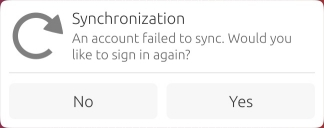
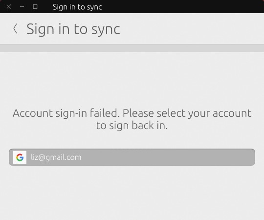

# Sync Monitor

Sync Monitor manages syncing Evolution calendars on a schedule. When a sync job fails, Sync Monitor sends a notification to the user asking them to fix their account.

## Troubleshooting

See [Working on the Calendar feature](https://docs.ubports.com/en/latest/systemdev/calendars.html) to learn about sync-monitor's role and how to troubleshoot it.

## Building

Sync Monitor can be built and run on your device using Crossbuilder. See [the Crossbuilder repository](https://github.com/ubports/crossbuilder/) to learn more.

## Contributing

You are welcome to propose patches for inclusion in sync-monitor. [System software development](https://docs.ubports.com/systemdev) is a good document to help you get started with this process.

Please note that once a build is complete, you will find that `po/sync-monitor.pot` has been changed. Please commit this with your changes.
